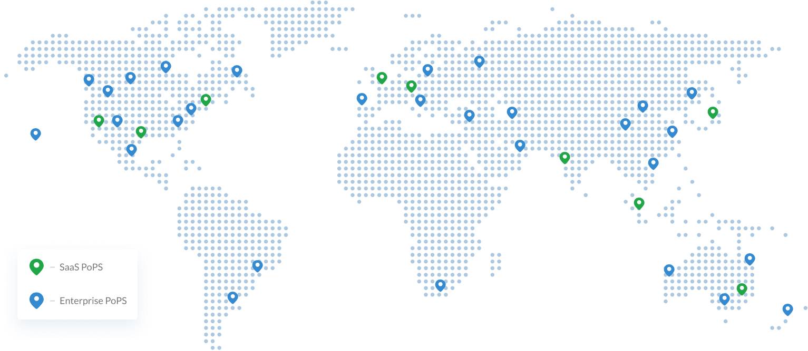

# Macrometa GDN - XBook

**Distributed Systems & Edge Computing for Developers: from Macrometa**

**Table of Contents**
1. [Macrometa GDN](#macrometa-gdn)
2. [Getting Started](#getting-started)
3. [Software Requirements](#software-requirements)
4. [Takeaways](#takeaways)

Welcome to *Distributed Systems & Edge Cloud for Developers*! This book introduces distributed systems and edge computing and dives into the Macrometa GDN and what its capabilities and values provide. You'll be able to use this book to "learn from experience" via a series of short tutorials that cover concepts ranging from simple tasks, like connecting to Macrometa GDN and creating a collection or a RestQL API, to more advanced tasks, like configuring distributed systems and complex event processing (CEP).

Hope you enjoy it!

from, **the Macrometa Team**

---

## Macrometa GDN

Macrometa GDN is a first-of-its-kind Edge Cloud. GDN is a converged platform that includes a Multi-Model NoSQL database, pub/sub, event processing, and serverless global data platform for building geo-distributed and real-time applications.

Macrometa's Global Data Network (GDN) allows organizations to tier, cache, process, and serve data with a global P90 roundtrip response time of 50ms. With 175+ points of presence (PoPs) worldwide, Macrometa brings data and consistency closer to users while maintaining a coordination-free architecture.

---

## Getting Started

To get started, we recommend one of the following options:

1. **Local Host:** If you download this book to your computer and work with the tutorials locally, you'll be able to access Macrometa GDN from anywhere in the world. This option connects to the most local GDN point of presence for a P90 50ms RTT. This simulates how an end device would connect to GDN via an Access Network or ISP.
2. **Macrometa Compute:** Running this Book in Macrometa Compute via Jupyter Hub allows you to run workbooks and tutorials from Macrometa GDN. The code of the Tutorials and Workbooks runs in the edge cloud itself in the same way a microservice would run on Macrometa Compute (CaaS).
3. **CoLab:** If you utilize the free CoLab service from Google to run this book, the Tutorial Code will run in a Public Cloud environment, which simulates a complete picture of how distributed systems can be deployed.

If you need help with getting started (or anything else!), you can join our community slack channel [here]()

---

## Software Requirements

In this book, you will use Macrometa Python ([PYC8](https://github.com/Macrometacorp/pyC8)) & JavaScript ([JSC8](https://github.com/Macrometacorp/jsC8)) drivers as well as the Macrometa Command Line Interface ([GDNSL](https://www.npmjs.com/package/gdnsl)).

There are tutorials for each method of accessing Macrometa GDN; we recommend that you introduce yourself to the Macrometa GDN using the tutorial in the language you are most familiar with before moving on to the tutorials in other languages to make it easier to grasp the GDN-specific concepts. Each tutorial accomplishes the same goal using different drivers or GDNSL.

---

## Takeaways

After finishing this eBook, you will know:

- How to connect to Macrometa GDN
- How to create and configure user access
- How to create Collections, like K/V, Document, & Graph
- How to create and manage RESTQL CRUD APIs
- How to build applications that use graph traversals
- How to create and manage GeoFabrics for GDPR and PII use cases
- How to create and deploy Macrometa FaaS & Stream Workers
- How to build CI/CD pipelines
- How to work with Macrometa Compute (CaaS)
- How to deploy your own MicroServices at the Edge like ML/AI etc

And much, much more, as we add more tutorials!

---
